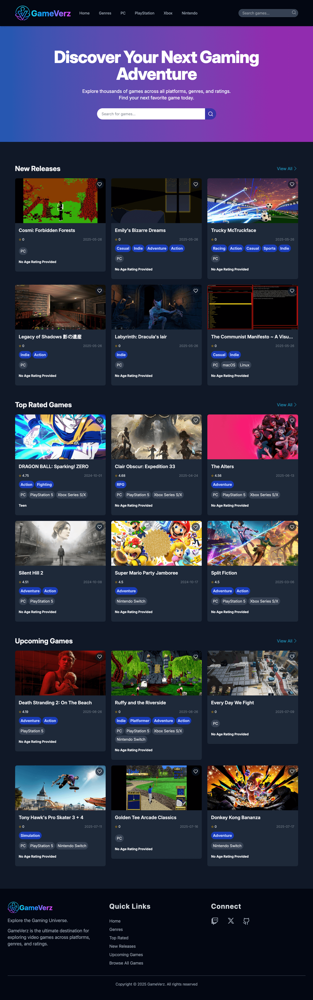
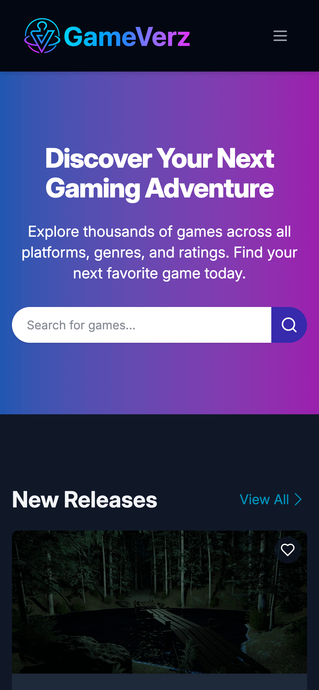

# GameVerz 🎮

## Description
A modern video game discovery web app built with Node.js and the RAWG Video Games Database API.

## 🚀 Overview
GameVerz lets users explore and discover video games across different categories including:

* New Releases
* Top Rated
* Upcoming Titles
* All Games

Users can filter, browse, and view detailed game information—all powered by the RAWG API.

## 🔧 Tech Stack
* Node.js + Express – Backend server
* EJS – Templating engine for rendering dynamic pages
* Axios – API requests to RAWG
* RAWG Video Games Database API – Data source for games
* Tailwind CSS – Styling
* JavaScript (ES6) – Client and server logic

## 🧠 Features
* Browse games by category (New Releases, Top Rated, Upcoming, All Games)
* Paginated results with clean navigation
* Responsive UI with intuitive layout
* Only displays games with valid images for better visual experience
* Excludes 18+ rated games 

## 🖼️ Screenshots
### Desktop:

### Mobile:

## 📝 To-Do
* Add user login
* Add "Add to favorites" functionality.

## 📜 License
This project is open source and available under the MIT License.

## 🌐 Live Application
[GameVerz](https://)

## Credits
Game data provided by the [RAWG Video Games Database API](https://rawg.io/apidocs)
